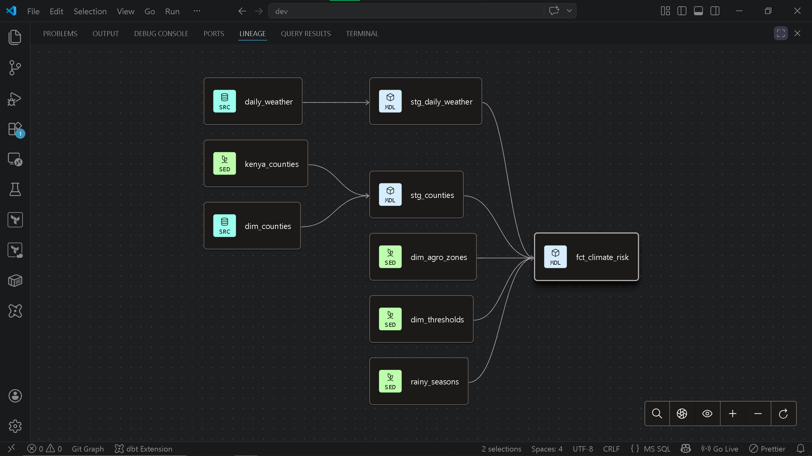

# Kenya Climate Risk Monitor
### Drought & Flood Early Warning System

## Problem Statement
Kenya's 47 counties face recurring drought and flood crises that affect
millions of people, particularly in ASAL (Arid and Semi-Arid) regions.
Early warning systems can give communities and authorities days or weeks
of advance notice to prepare. This project builds an automated data
pipeline that ingests daily weather data for all 47 Kenyan counties,
detects anomalies against 40+ year historical baselines, and surfaces
risk scores on an interactive dashboard.

## Project Architecture

## Tech Stack
<!-- fill this in as you add tools -->
### Cloud Infrastructure

### Data Engineering

### Infrastructure as Code

## Project Structure
<!-- paste folder tree here -->

## Data Sources
| Source | Type | Coverage | Used for |
|--------|------|---------|---------|
| Open-Meteo Archive API | Daily weather | 1981–present | Historical baseline |
| Open-Meteo Forecast API | Daily weather | Real-time | Daily ingestion |
| KMD ENACTS Portal | Rainfall | 1981–2022 | Validation |

## Pipeline Phases
- [x] Phase 1: Data gathering & reference tables
- [x] Phase 2: BigQuery schema & historical load
- [x] Phase 3: Automation & orchestration
- [ ] Phase 4: Dashboard

## Dashboard
<!-- add screenshots here when ready -->
### dbt lineage

## Steps to Reproduce
<!-- fill in as you build -->

## Contact
**Chacha Marwa** — Junior Data Engineer
- GitHub: [ChachaMarwaDev](https://github.com/ChachaMarwaDev)
- LinkedIn: [chacha-marwa-dev](https://linkedin.com/in/chacha-marwa-dev-355394257)
- X: [@chachamarwadev](https://x.com/chachamarwadev)
- Portfolio: [chachamarwadev.com](https://sites.google.com/view/chachamarwadev)
