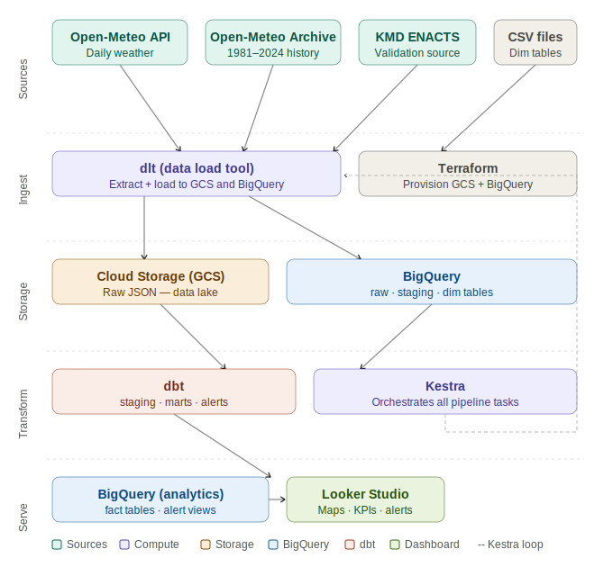
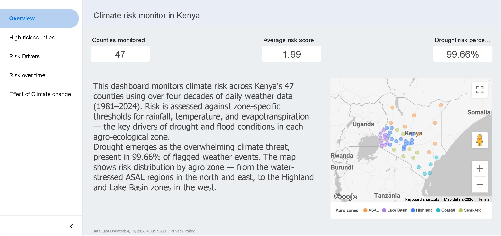

# Kenya Climate Risk Monitor
### Drought & Flood Early Warning System


## Problem Statement
Kenya's 47 counties face recurring drought and flood crises that affect
millions of people, particularly in ASAL (Arid and Semi-Arid) regions.
Early warning systems can give communities and authorities days or weeks
of advance notice to prepare. This project builds an automated data
pipeline that ingests daily weather data for all 47 Kenyan counties,
detects anomalies against 40+ year historical baselines, and surfaces
risk scores on an interactive dashboard.

## Project Architecture



## Tech Stack
<!-- fill this in as you add tools -->
### Cloud Infrastructure


### Data Engineering


### Infrastructure as Code


### Containerization


### Programming Languages


### Key Libraries
- `dlt` - Data extraction and loading
- `pandas` - Data manipulation
- `pyarrow` - Efficient data processing
- `google-cloud-bigquery` - BigQuery client
- `google-cloud-storage` - Cloud Storage client
- `pydantic` - Data validation
- `tenacity` - Retry logic
- `sqlparse` - SQL parsing

## Project Structure
```text
kenya-climate-risk-monitor/
│
├── .gitignore
├── LICENSE
├── README.md
├── docker-compose.yaml
├── dockerfile
│
├── data/
│   ├── historical/
│   │   └── kenya_weather_2019.csv
│   ├── KenyaRegions.json
│   └── kenya_counties.csv
│
├── docs/
│   ├── dbt_lineage.jpg
│   ├── entity_relationship_diagram.svg
│   ├── kenya_weather_gcp_architecture.svg
│   ├── kestra_dashboard.jpg
│   └── methodology.md
│
├── extraction/
│   ├── .dlt/
│   │   └── config.toml
│   ├── .gitignore
│   ├── backfill_historical.py
│   ├── pipeline_backfill.py
│   ├── pipeline_daily.py
│   ├── pipeline_dims.py
│   ├── pipeline_weather_source.py
│   ├── retry_failed.py
│   ├── wasp_mining.py
│   └── wasp_test.py
│
├── dbt/
│   ├── .gitignore
│   ├── dbt_env/              # Python virtual environment (ignored)
│   ├── kenya_climate_risk_monitor/
│   │   ├── .gitignore
│   │   ├── README.md
│   │   ├── dbt_project.yml
│   │   ├── analyses/
│   │   │   └── .gitkeep
│   │   ├── macros/
│   │   │   └── .gitkeep
│   │   ├── models/
│   │   │   ├── mart/
│   │   │   │   ├── fct_climate_risk.sql
│   │   │   │   └── schema.yml
│   │   │   └── staging/
│   │   │       ├── sources.yml
│   │   │       ├── stg_counties.sql
│   │   │       └── stg_daily_weather.sql
│   │   ├── seeds/
│   │   │   ├── dim_agro_zones.csv
│   │   │   ├── dim_thresholds.csv
│   │   │   ├── kenya_counties.csv
│   │   │   └── rainy_seasons.csv
│   │   ├── snapshots/
│   │   │   └── .gitkeep
│   │   ├── tests/
│   │   │   └── .gitkeep
│   │   └── logs/
│   │       └── query_log.sql
│   └── logs/
│       └── query_log.sql
│
├── terraform/
│   ├── .gitignore
│   ├── .terraform.lock.hcl
│   ├── main.tf
│   ├── variables.tf
│   ├── outputs.tf
│   ├── bigquery.tf
│   ├── storage.tf
│   ├── iam.tf
│   ├── terraform.tfstate
│   └── terraform.tfstate.backup
│
└── logs/
    └── query_log.sql
```

## Data Sources
| Source | Type | Coverage | Used for |
|--------|------|---------|---------|
| Open-Meteo Archive API | Daily weather | 1981–present | Historical baseline |
| Open-Meteo Forecast API | Daily weather | Real-time | Daily ingestion |
| KMD ENACTS Portal | Rainfall | 1981–2022 | Validation |

## Pipeline Phases
- [x] Phase 1: Data gathering & reference tables
- [x] Phase 2: BigQuery schema & historical load
- [x] Phase 3: Automation & orchestration
- [x] Phase 4: Dashboard

## Dashboard
<!-- add screenshots here when ready -->
### Overview of the dashboard

For the full dashboard here is the 


### dbt Lineage Dashboard


### Kestra Orchestration Dashboard


## Steps to Reproduce
<!-- fill in as you build -->
### Prerequisites
 
Make sure you have the following installed before you begin:
 
| Tool | Purpose |
|---|---|
| [Python 3.13.5](https://www.python.org/downloads/) | Running dlt pipelines |
| [Docker Desktop](https://www.docker.com/products/docker-desktop/) | Running Kestra orchestration |
| [Terraform](https://developer.hashicorp.com/terraform/install) | Provisioning GCP infrastructure |
| [Google Cloud SDK](https://cloud.google.com/sdk/docs/install) (`gcloud`) | Authentication and GCP access |
| [dlt](https://dlthub.com/docs/intro) | Data ingestion pipeline |
| [dbt](https://docs.getdbt.com/docs/core/installation-overview) | Data transformation layer |
 
---
 
### 1. Clone the repository
 
```bash
git clone https://github.com/ChachaMarwaDev/kenya-climate-risk-monitor.git
cd kenya-climate-risk-monitor
```
 
---
 
### 2. Set up GCP
 
You will need a GCP project with billing enabled.
 
#### 2a. Authenticate with Application Default Credentials
 
```bash
gcloud auth application-default login
gcloud config set project YOUR_GCP_PROJECT_ID
```
 
#### 2b. Enable required APIs
 
```bash
gcloud services enable bigquery.googleapis.com
gcloud services enable storage.googleapis.com
```
 
#### 2c. Provision infrastructure with Terraform
 
```bash
cd terraform/
terraform init
terraform plan
terraform apply
```
 
This creates:
- A BigQuery dataset (`raw_weather`) in `europe-west1`
- A GCS bucket for pipeline state
 
> After `terraform apply`, note your project ID and bucket name — you will need them in the next steps.
 
---
 
### 3. Install Python dependencies
 
```bash
cd extraction/
pip install dlt[bigquery] dlt[filesystem] requests
```
 
---
 
### 4. Configure dlt
 
The dlt config file is at `extraction/.dlt/config.toml`. Update it with your GCP project details:
 
```toml
[destination.bigquery]
project_id = "your-gcp-project-id"
location = "europe-west1"
```
 
---
 
### 5. Run the dlt ingestion pipeline
 
All pipeline scripts live in the `extraction/` folder.
 
First load the dimension tables (counties, agro zones, thresholds, rainy seasons):
 
```bash
python pipeline_dims.py
```
 
Then run the historical backfill (loads weather data from 1981 to present — may take several minutes):
 
```bash
python pipeline_backfill.py
```
 
For ongoing daily updates:
 
```bash
python pipeline_daily.py
```
 
All pipelines load into BigQuery under the `raw_weather` dataset.
 
---
 
### 6. Run dbt transformations
 
The dbt project lives inside `dbt/kenya_climate_risk_monitor/`.
 
```bash
cd ../dbt/kenya_climate_risk_monitor/
dbt deps
dbt seed
dbt run
dbt test
```
 
> `dbt seed` loads the reference CSV files from the `seeds/` folder (counties, agro zones, thresholds, rainy seasons).
 
This builds the staging and mart layers, including `fct_climate_risk` — the final table used in the dashboard.
 
---
 
### 7. Start Kestra orchestration (optional)
 
Kestra automates the daily pipeline runs using Docker. From the project root:
 
```bash
docker compose up -d
```
 
Then open [http://localhost:8080](http://localhost:8080) to access the Kestra UI and trigger or schedule flows.
 
---
 
### 8. View the dashboard
 
The Looker Studio dashboard connects to `fct_climate_risk` in BigQuery.
 
- **Live dashboard:** [](YOUR_DASHBOARD_URL)
- To connect your own BigQuery: open Looker Studio → Add data source → BigQuery → select your project → `raw_weather` → `fct_climate_risk`


## Contact
**Chacha Marwa** — Junior Data Engineer
- GitHub: [ChachaMarwaDev](https://github.com/ChachaMarwaDev)
- LinkedIn: [chacha-marwa-dev](https://linkedin.com/in/chacha-marwa-dev-355394257)
- X: [@chachamarwadev](https://x.com/chachamarwadev)
- Portfolio: [chachamarwadev.com](https://sites.google.com/view/chachamarwadev)
